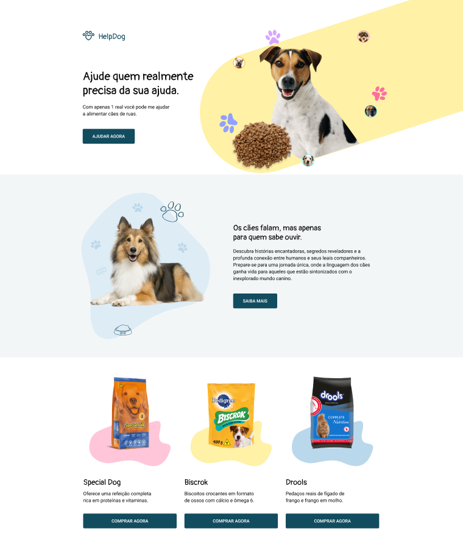

# HelpDog

> Status : Progress ⏳

## Challenge [09] Codelândia - Iuri Silva
>Veja o design: https://www.figma.com/design/Yb9IBH56g7T1hdIyZ3BMNO/Desafios---CodeLab

_Technologies_

- Html5 
- Css3 
- Vue ✌️
- SASS 🎨
- Vite ⚡

### How to use

- git clone https://github.com/I-Samuel-I/HelpDog download the zip
- npm install / yarn install
- code . (if you use VSCode)
- npm run dev 

## 💻 Online Page: 

## 🌐 Contats:

